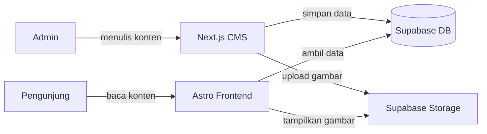

# Rencana Integrasi: Astro Frontend ↔ Supabase CMS

## Gambaran Besar

Saat ini kita memiliki **dua sistem yang berjalan terpisah**:

| Sistem | Tech | Lokasi | Fungsi |
|--------|------|--------|--------|
| **Frontend** | Astro + Tailwind | `arkara/` | Website publik (blog, panduan, landing page) |
| **CMS** | Next.js + Supabase | `nextjsCMS/` | Admin panel (CRUD posts, panduan, media, AI) |

**Tujuan Integrasi**: Menghubungkan Frontend Astro agar membaca data langsung dari tabel Supabase (`posts`, `panduan`, `media`) yang diisi melalui CMS, **menggantikan** sistem `astro:content` (file MDX lokal) yang saat ini digunakan.



---

## Peta Data: CMS → Frontend

### Tabel `posts` (Supabase)
| Kolom CMS | Tipe | Mapping Astro Sebelumnya | Keterangan |
|-----------|------|--------------------------|------------|
| `title` | text | `entry.data.title` | Judul artikel |
| `slug` | text | `entry.slug` | URL path |
| `description` | text | `entry.data.description` | Ringkasan |
| `content` | text | [Content](file:///g:/My%20Own%20Project/Buku%201/Web/arkara/src/lib/cms-content-manager.ts#69-491) (rendered MDX) | Konten Markdown |
| `category` | text | `entry.data.category` | air/energi/pangan/medis/keamanan/komunitas |
| `status` | text | *(tidak ada, semua published)* | draft/published — **hanya tampilkan `published`** |
| `cover_image` | text | `entry.data.coverImage` | URL gambar dari Supabase Storage |
| `published_at` | timestamp | `entry.data.publishDate` | Tanggal publikasi |
| `meta_title` | text | *(tidak ada)* | SEO title |
| `meta_desc` | text | *(tidak ada)* | SEO description |

### Tabel `panduan` (Supabase)
| Kolom CMS | Tipe | Mapping Astro Sebelumnya |
|-----------|------|--------------------------|
| `title` | text | `entry.data.title` |
| `slug` | text | `entry.slug` |
| `content` | text | [Content](file:///g:/My%20Own%20Project/Buku%201/Web/arkara/src/lib/cms-content-manager.ts#69-491) (rendered MDX) |
| `bab_ref` | text | `entry.data.babRef` |
| `qr_slug` | text | `entry.data.qrSlug` |
| `status` | text | *(tidak ada)* |
| `cover_image` | text | *(tidak ada)* |

---

## Fase Implementasi

### PART 1: Supabase SDK di Astro
**Estimasi**: ~15 menit
**File yang dibuat/diubah**: 3 file

| # | Aksi | File | Detail |
|---|------|------|--------|
| 1.1 | Install | [package.json](file:///g:/My%20Own%20Project/Buku%201/Web/arkara/package.json) | `npm install @supabase/supabase-js` |
| 1.2 | Buat | `src/lib/supabase.ts` | Inisialisasi Supabase client dengan `SUPABASE_URL` + `SUPABASE_ANON_KEY` |
| 1.3 | Update | [.env](file:///g:/My%20Own%20Project/Buku%201/Web/arkara/.env) + [.env.example](file:///g:/My%20Own%20Project/Buku%201/Web/arkara/.env.example) | Tambahkan `SUPABASE_URL` dan `SUPABASE_ANON_KEY` |

> [!IMPORTANT]
> Astro frontend hanya perlu **Anon Key** (read-only) karena ia hanya membaca data publik. **Service Role Key TIDAK diperlukan** di sisi frontend.

**Kode `src/lib/supabase.ts`** (preview):
```typescript
import { createClient } from '@supabase/supabase-js'

const supabaseUrl = import.meta.env.SUPABASE_URL
const supabaseAnonKey = import.meta.env.SUPABASE_ANON_KEY

export const supabase = createClient(supabaseUrl, supabaseAnonKey)
```

---

### PART 2: Data Fetching Layer
**Estimasi**: ~20 menit
**File yang dibuat/diubah**: 1 file (menggantikan [cms-content-manager.ts](file:///g:/My%20Own%20Project/Buku%201/Web/arkara/src/lib/cms-content-manager.ts))

| # | Aksi | File | Detail |
|---|------|------|--------|
| 2.1 | Buat | `src/lib/content.ts` | Fungsi-fungsi query Supabase untuk posts & panduan |

**Fungsi yang akan dibuat:**

```typescript
// Posts
getPublishedPosts(options?: { category?, limit?, offset? })
getPostBySlug(slug: string)
getRecentPosts(count: number)
getCategories()  // aggregate dari posts yang ada

// Panduan
getPublishedPanduan()
getPanduanBySlug(slug: string)
```

> [!NOTE]
> Semua query akan **memfilter `status = 'published'`** secara otomatis. Draft tidak pernah terlihat di frontend publik.

---

### PART 3: Migrasi Halaman Astro
**Estimasi**: ~30 menit  
**File yang diubah**: 5 file

Ini adalah inti dari integrasi — mengganti `getCollection('blog')` dan `getCollection('panduan')` dengan query Supabase.

| # | Aksi | File | Perubahan |
|---|------|------|-----------|
| 3.1 | Update | [src/pages/index.astro](file:///g:/My%20Own%20Project/Buku%201/Web/arkara/src/pages/index.astro) | Ganti `getCollection('blog')` → [getRecentPosts(3)](file:///g:/My%20Own%20Project/Buku%201/Web/arkara/src/lib/cms-content-manager.ts#150-160) |
| 3.2 | Update | [src/pages/blog/index.astro](file:///g:/My%20Own%20Project/Buku%201/Web/arkara/src/pages/blog/index.astro) | Ganti `getCollection('blog')` → `getPublishedPosts({category})` |
| 3.3 | **Rewrite** | `src/pages/blog/[slug].astro` | Hapus `prerender + getStaticPaths`, ganti ke dynamic SSR. Ambil data via [getPostBySlug(slug)](file:///g:/My%20Own%20Project/Buku%201/Web/arkara/src/lib/cms-content-manager.ts#120-139). Render markdown content secara manual. |
| 3.4 | Update | [src/pages/panduan/index.astro](file:///g:/My%20Own%20Project/Buku%201/Web/arkara/src/pages/panduan/index.astro) | Ganti `getCollection('panduan')` → `getPublishedPanduan()` |
| 3.5 | **Rewrite** | `src/pages/panduan/[slug].astro` | Sama seperti 3.3 — dynamic SSR + render markdown |

> [!WARNING]
> **Perubahan kritis di `[slug].astro`**: Saat ini file ini menggunakan `export const prerender = true` + `getStaticPaths()` yang hanya bekerja dengan file lokal. Kita harus mengubahnya ke **SSR murni** yang query Supabase saat halaman diminta agar konten selalu terbaru.

**Contoh transformasi `blog/[slug].astro`:**

```diff
- import { getCollection, render } from 'astro:content';
+ import { getPostBySlug } from '../../lib/content';
+ import { marked } from 'marked';  // untuk render markdown
  import PostLayout from '../../layouts/PostLayout.astro';

- export const prerender = true;
-
- export async function getStaticPaths() {
-   const blogEntries = await getCollection('blog');
-   return blogEntries.map((entry) => ({
-     params: { slug: entry.slug },
-     props: { entry },
-   }));
- }
-
- const { entry } = Astro.props;
- const { Content } = await render(entry);
+ const { slug } = Astro.params;
+ const post = await getPostBySlug(slug!);
+
+ if (!post) return Astro.redirect('/404');
+
+ const htmlContent = marked(post.content || '');
```

---

### PART 4: Markdown Rendering
**Estimasi**: ~10 menit
**File yang dibuat**: 1 file

Konten dari CMS disimpan sebagai **Markdown mentah** (string teks). Kita perlu library untuk merendernya ke HTML di sisi Astro.

| # | Aksi | File | Detail |
|---|------|------|--------|
| 4.1 | Install | [package.json](file:///g:/My%20Own%20Project/Buku%201/Web/arkara/package.json) | `npm install marked` |
| 4.2 | Buat | `src/lib/markdown.ts` | Konfigurasi `marked` dengan opsi sanitize dan heading anchor |

> [!TIP]
> Kita sudah punya CSS untuk `.prose-arkara` di [PostLayout.astro](file:///g:/My%20Own%20Project/Buku%201/Web/arkara/src/layouts/PostLayout.astro). Cukup masukkan HTML yang di-render ke dalam elemen `<div class="prose prose-arkara">` dan styling akan otomatis berlaku.

---

### PART 5: Gambar & Media
**Estimasi**: ~10 menit
**File yang diubah**: 2 file

Cover image dari CMS adalah URL Supabase Storage. Kita perlu memastikan domain tersebut diizinkan oleh Astro image optimizer.

| # | Aksi | File | Detail |
|---|------|------|--------|
| 5.1 | Update | [astro.config.mjs](file:///g:/My%20Own%20Project/Buku%201/Web/arkara/astro.config.mjs) | Tambahkan domain Supabase Storage ke `image.domains` |
| 5.2 | Update | [src/components/blog/PostCard.astro](file:///g:/My%20Own%20Project/Buku%201/Web/arkara/src/components/blog/PostCard.astro) | Pastikan properti `image` menerima URL absolut (bukan path relatif lokal) |

**Perubahan [astro.config.mjs](file:///g:/My%20Own%20Project/Buku%201/Web/arkara/astro.config.mjs):**
```diff
  image: {
-   domains: ['arkara-media.fly.storage.tigris.dev'],
+   domains: [
+     'arkara-media.fly.storage.tigris.dev',
+     'hriygsbwmqfnbkpuiqkf.supabase.co',
+   ],
  },
```

---

### PART 6: Pembersihan Warisan
**Estimasi**: ~10 menit

Menghapus sisa-sisa sistem file-based content yang sudah tidak dibutuhkan.

| # | Aksi | File/Folder | Detail |
|---|------|-------------|--------|
| 6.1 | Hapus | [src/content/config.ts](file:///g:/My%20Own%20Project/Buku%201/Web/arkara/src/content/config.ts) | Content collection schema tidak diperlukan lagi |
| 6.2 | Hapus | `src/content/blog/*.mdx` | Artikel contoh lama |
| 6.3 | Hapus | `src/content/panduan/*.mdx` | Panduan contoh lama |
| 6.4 | Hapus | [src/lib/cms-content-manager.ts](file:///g:/My%20Own%20Project/Buku%201/Web/arkara/src/lib/cms-content-manager.ts) | Diganti oleh [content.ts](file:///g:/My%20Own%20Project/Buku%201/Web/arkara/src/pages/api/generate-content.ts) yang baru |
| 6.5 | Hapus | `src/pages/api/cms/*` | API endpoint lama (sekarang CMS terpisah) |
| 6.6 | Update | [BaseLayout.astro](file:///g:/My%20Own%20Project/Buku%201/Web/arkara/src/layouts/BaseLayout.astro) | Hapus link "CMS (Keystatic)" dari navbar |
| 6.7 | Hapus | [keystatic.config.ts](file:///g:/My%20Own%20Project/Buku%201/Web/arkara/keystatic.config.ts) | *(sudah dihapus sebelumnya)* |
| 6.8 | Hapus | [test-form.mjs](file:///g:/My%20Own%20Project/Buku%201/Web/arkara/test-form.mjs) | File tes yang tidak diperlukan |

---

### PART 7: Testing & Deployment
**Estimasi**: ~15 menit

| # | Aksi | Detail |
|---|------|--------|
| 7.1 | Local Test | Jalankan `astro dev` dan verifikasi homepage, blog list, blog detail, panduan list, panduan detail |
| 7.2 | Build Test | Jalankan `astro build` dan pastikan 0 error |
| 7.3 | Railway Env | Tambahkan `SUPABASE_URL` dan `SUPABASE_ANON_KEY` ke Railway environment variables |
| 7.4 | Deploy | Push ke Git → Railway auto-deploy |
| 7.5 | Smoke Test | Buka URL production dan pastikan konten dari CMS tampil dengan benar |

---

## Rangkuman Urutan Eksekusi

```
PART 1 → Setup SDK Supabase           [3 file]
PART 2 → Data Fetching Layer          [1 file]
PART 3 → Migrasi 5 Halaman Astro      [5 file]  ← INTI
PART 4 → Markdown Rendering           [1 file]
PART 5 → Konfigurasi Gambar           [2 file]
PART 6 → Bersih-bersih File Lama      [~8 file]
PART 7 → Testing & Deployment         [config]
```

**Total file yang tersentuh**: ~20 file  
**Estimasi waktu total**: ~1.5–2 jam

---

## Risiko & Mitigasi

| Risiko | Dampak | Mitigasi |
|--------|--------|----------|
| RLS memblokir read dari Anon Key | Data tidak muncul di frontend | Pastikan RLS policy `SELECT` untuk `anon` role sudah aktif pada tabel `posts` dan `panduan` |
| Markdown rendering tidak sempurna | Format konten rusak di frontend | Gunakan `marked` dengan konfigurasi yang tepat, test dengan konten nyata |
| Gambar Storage tidak bisa diakses | Gambar broken di frontend | Pastikan bucket `media` berstatus `public` di Supabase |
| Build time error karena `astro:content` removal | Build gagal | Pastikan semua import `getCollection` sudah diganti sebelum menghapus folder `content/` |

> [!CAUTION]
> **Urutan penting!** Jangan hapus folder `src/content/` (Part 6) sebelum semua halaman sudah dimigrasi ke Supabase (Part 3). Jika tidak, build akan gagal karena masih ada import `getCollection` yang merujuk ke file lokal.
